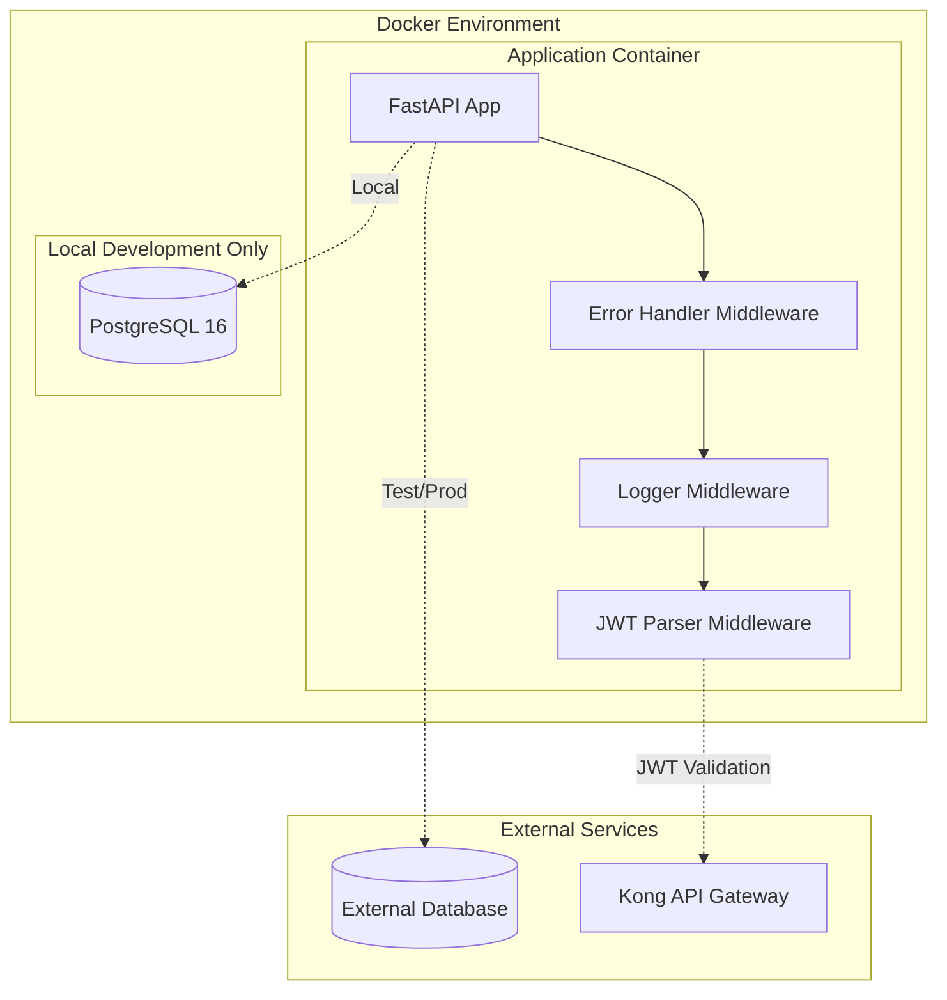
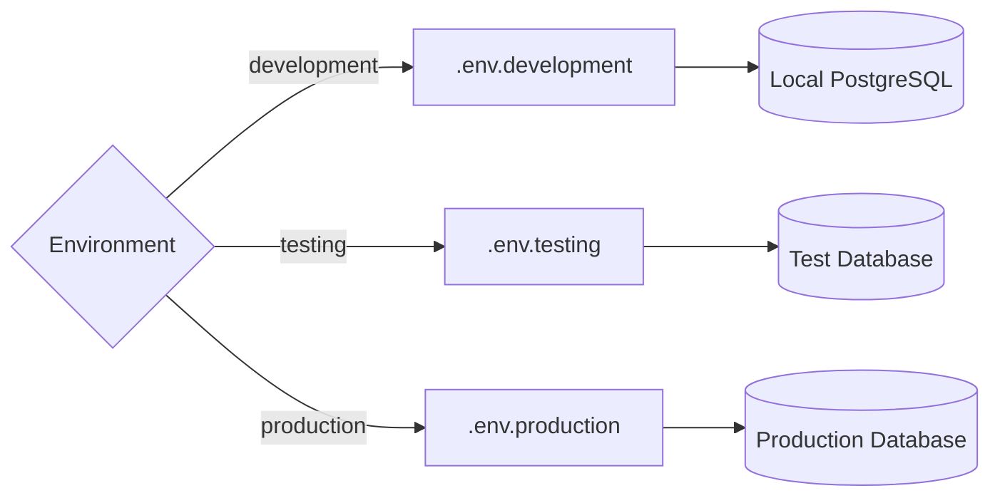

# Design Document

## Overview

此設計文件描述了基礎建設功能的完整架構，包含 Docker 容器化、多環境配置管理、核心中介軟體（錯誤處理、結構化日誌、JWT 解析）的實作方式。設計基於現有的 FastAPI 應用程式架構，並擴展其功能以支援生產環境的需求。

## Architecture

### 系統架構圖



### 環境配置架構



## Components and Interfaces

### 1. Docker 配置組件

#### Dockerfile

- 基於 Python 3.12 slim 映像
- 多階段建構以優化映像大小
- 支援開發和生產環境的不同配置

#### Docker Compose

- `docker-compose.yml`: 基礎服務定義
- `docker-compose.override.yml`: 本地開發覆蓋配置
- `docker-compose.prod.yml`: 生產環境配置

### 2. 環境配置管理

#### 配置檔案結構

```
backend/
├── .env.development    # 本地開發環境
├── .env.testing       # 測試環境
├── .env.production    # 生產環境
└── .env.example       # 範例檔案
```

#### 配置類別擴展

```python
class Settings(BaseSettings):
    # Environment
    ENVIRONMENT: str = "development"

    # Application
    APP_NAME: str
    DEBUG: bool
    VERSION: str

    # Database
    DATABASE_URL: str

    # Logging
    LOG_LEVEL: str = "INFO"
    LOG_FILE_PATH: str = "logs/app.log"
    LOG_FORMAT: str = "json"

    # CORS
    BACKEND_CORS_ORIGINS: list

    class Config:
        env_file = f".env.{os.getenv('ENVIRONMENT', 'development')}"
```

### 3. 中介軟體組件

#### 錯誤處理中介軟體

- 全域異常捕獲
- 結構化錯誤回應
- 錯誤日誌記錄
- HTTP 狀態碼對應

#### 日誌中介軟體

- 請求/回應日誌記錄
- 結構化 JSON 格式
- 檔案輪轉機制
- 效能指標記錄

#### JWT 解析中介軟體

- JWT token 解析
- 使用者資訊提取
- 請求上下文注入
- 錯誤容忍機制

## Data Models

### 日誌資料模型

```python
class LogEntry(BaseModel):
    timestamp: datetime
    level: str
    message: str
    request_id: Optional[str]
    user_id: Optional[str]
    method: Optional[str]
    path: Optional[str]
    status_code: Optional[int]
    duration_ms: Optional[float]
    extra: Optional[Dict[str, Any]]
```

### 使用者上下文模型

```python
class UserContext(BaseModel):
    user_id: Optional[str]
    username: Optional[str]
    email: Optional[str]
    roles: List[str] = []
    permissions: List[str] = []
```

### 錯誤回應模型

```python
class ErrorResponse(BaseModel):
    error: str
    message: str
    details: Optional[Dict[str, Any]]
    timestamp: datetime
    request_id: str
```

## Error Handling

### 錯誤處理策略

1. **應用程式層級錯誤**

   - HTTP 異常處理
   - 驗證錯誤處理
   - 業務邏輯錯誤處理

2. **系統層級錯誤**

   - 資料庫連接錯誤
   - 外部服務錯誤
   - 未預期的系統異常

3. **中介軟體錯誤**
   - JWT 解析錯誤（非阻塞）
   - 日誌記錄錯誤
   - 中介軟體鏈錯誤

### 錯誤回應格式

```json
{
  "error": "ValidationError",
  "message": "Invalid input data",
  "details": {
    "field": "email",
    "issue": "Invalid email format"
  },
  "timestamp": "2024-01-01T12:00:00Z",
  "request_id": "req_123456"
}
```

## Testing Strategy

### 單元測試

- 中介軟體功能測試
- 配置載入測試
- 錯誤處理測試
- JWT 解析測試

### 整合測試

- Docker 容器啟動測試
- 資料庫連接測試
- 環境變數載入測試
- 中介軟體鏈測試

### 端到端測試

- 完整請求流程測試
- 多環境配置測試
- 日誌記錄驗證
- 錯誤處理驗證

### 測試環境配置

- 測試專用的 Docker Compose 配置
- 模擬外部服務
- 測試資料庫隔離
- 日誌輸出驗證

## Implementation Details

### Docker 配置實作

- 使用多階段建構優化映像大小
- 健康檢查配置
- 環境變數注入
- 卷掛載配置

### 中介軟體執行順序

1. 錯誤處理中介軟體（最外層）
2. 日誌中介軟體
3. JWT 解析中介軟體
4. 應用程式路由

### 日誌配置

- 使用 Loguru 作為日誌框架
- JSON 格式輸出
- 檔案輪轉配置
- 不同環境的日誌等級

### 環境切換機制

- 透過 ENVIRONMENT 環境變數控制
- 自動載入對應的 .env 檔案
- 配置驗證和預設值處理
