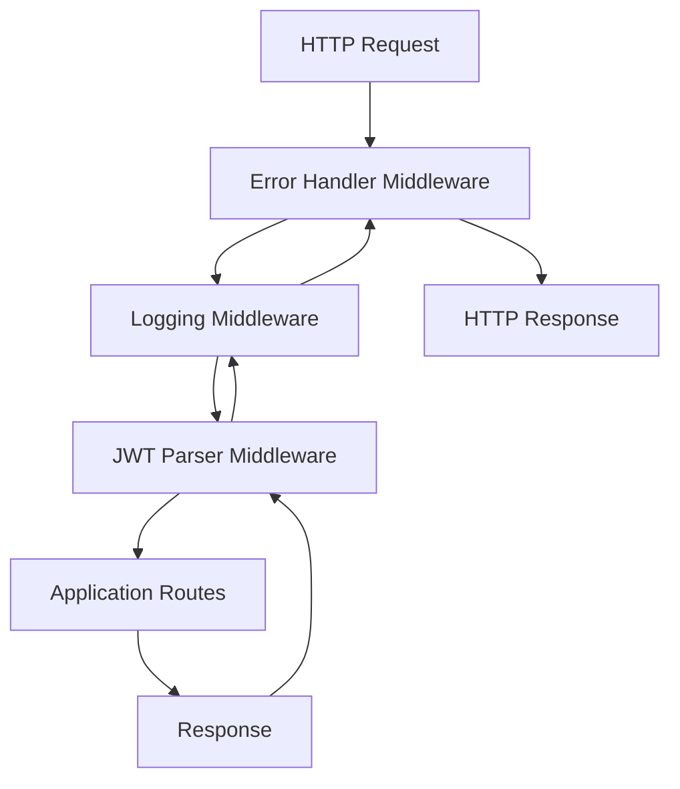

# 中介軟體使用指南

本文件詳細說明系統中各種中介軟體的功能、配置和使用方式。

## 中介軟體概覽

系統包含三個核心中介軟體，按執行順序排列：

1. **錯誤處理中介軟體** (Error Handler Middleware)
2. **日誌記錄中介軟體** (Logging Middleware)
3. **JWT 解析中介軟體** (JWT Parser Middleware)

## 中介軟體執行流程



## 錯誤處理中介軟體

### 功能特色

- 全域異常捕獲和處理
- 結構化錯誤回應格式
- 自動錯誤日誌記錄
- HTTP 狀態碼對應

### 使用方式

中介軟體會自動處理所有未捕獲的異常：

```python
from app.middleware.error_handler import ErrorHandlerMiddleware

# 在 main.py 中註冊
app.add_middleware(ErrorHandlerMiddleware)
```

### 錯誤回應格式

```json
{
  "error": "ValidationError",
  "message": "Invalid input data",
  "details": {
    "field": "email",
    "issue": "Invalid email format"
  },
  "timestamp": "2024-01-01T12:00:00Z",
  "request_id": "req_123456"
}
```

### 支援的異常類型

| 異常類型          | HTTP 狀態碼 | 描述           |
| ----------------- | ----------- | -------------- |
| `ValidationError` | 422         | 資料驗證錯誤   |
| `HTTPException`   | 依異常設定  | HTTP 相關異常  |
| `DatabaseError`   | 500         | 資料庫操作錯誤 |
| `Exception`       | 500         | 其他未預期異常 |

### 自訂異常處理

```python
from app.core.exceptions import CustomBusinessError

class CustomBusinessError(Exception):
    def __init__(self, message: str, details: dict = None):
        self.message = message
        self.details = details or {}
        super().__init__(self.message)

# 在路由中使用
@router.post("/items/")
async def create_item(item: ItemCreate):
    if not item.name:
        raise CustomBusinessError(
            message="Item name is required",
            details={"field": "name", "issue": "missing"}
        )
```

## 日誌記錄中介軟體

### 功能特色

- 結構化 JSON 日誌格式
- 請求/回應資訊記錄
- 效能指標追蹤
- 檔案輪轉機制

### 配置選項

```python
# 在 config.py 中配置
LOG_LEVEL = "INFO"
LOG_FILE_PATH = "logs/app.log"
LOG_FORMAT = "json"
LOG_ROTATION = "1 day"
LOG_RETENTION = "30 days"
```

### 日誌格式

```json
{
  "timestamp": "2024-01-01T12:00:00.123Z",
  "level": "INFO",
  "message": "HTTP Request",
  "request_id": "req_123456",
  "method": "POST",
  "path": "/api/v1/items",
  "status_code": 201,
  "duration_ms": 45.2,
  "user_id": "user_789",
  "extra": {
    "user_agent": "Mozilla/5.0...",
    "remote_addr": "192.168.1.100"
  }
}
```

### 日誌等級

| 等級       | 用途         | 範例               |
| ---------- | ------------ | ------------------ |
| `DEBUG`    | 詳細除錯資訊 | 變數值、執行流程   |
| `INFO`     | 一般資訊     | 請求處理、狀態變更 |
| `WARNING`  | 警告訊息     | 效能問題、棄用功能 |
| `ERROR`    | 錯誤訊息     | 異常處理、失敗操作 |
| `CRITICAL` | 嚴重錯誤     | 系統故障、安全問題 |

### 自訂日誌記錄

```python
from app.core.logging_config import get_logger

logger = get_logger(__name__)

# 在路由中使用
@router.post("/items/")
async def create_item(item: ItemCreate):
    logger.info("Creating new item", extra={
        "item_name": item.name,
        "user_id": "current_user_id"
    })

    try:
        result = await item_service.create(item)
        logger.info("Item created successfully", extra={
            "item_id": result.id
        })
        return result
    except Exception as e:
        logger.error("Failed to create item", extra={
            "error": str(e),
            "item_data": item.dict()
        })
        raise
```

## JWT 解析中介軟體

### 功能特色

- JWT token 自動解析
- 使用者資訊提取
- 請求上下文注入
- 錯誤容忍機制（不阻塞請求）

### 工作原理

1. 從 `Authorization` header 提取 JWT token
2. 解析 token 並驗證格式
3. 提取使用者資訊
4. 將使用者資訊注入請求上下文
5. 如果解析失敗，記錄錯誤但不阻塞請求

### 使用者上下文模型

```python
class UserContext(BaseModel):
    user_id: Optional[str] = None
    username: Optional[str] = None
    email: Optional[str] = None
    roles: List[str] = []
    permissions: List[str] = []
```

### 在路由中使用使用者資訊

```python
from fastapi import Request
from app.schemas.user import UserContext

@router.get("/profile")
async def get_profile(request: Request):
    user_context: UserContext = getattr(request.state, 'user_context', UserContext())

    if user_context.user_id:
        # 使用者已認證
        return {"user_id": user_context.user_id, "username": user_context.username}
    else:
        # 匿名使用者
        return {"message": "Anonymous user"}
```

### JWT Token 格式

預期的 JWT payload 格式：

```json
{
  "sub": "user_123",
  "username": "john_doe",
  "email": "john@example.com",
  "roles": ["user", "admin"],
  "permissions": ["read", "write"],
  "exp": 1640995200,
  "iat": 1640908800
}
```

### 錯誤處理

JWT 解析中介軟體採用錯誤容忍機制：

- **Token 無效**: 記錄警告，繼續處理請求
- **Token 過期**: 記錄資訊，繼續處理請求
- **Token 缺失**: 正常處理，不記錄錯誤
- **解析錯誤**: 記錄錯誤，繼續處理請求

## 中介軟體配置

### 註冊順序

在 `main.py` 中按正確順序註冊中介軟體：

```python
from app.middleware.error_handler import ErrorHandlerMiddleware
from app.middleware.logging_middleware import LoggingMiddleware
from app.middleware.jwt_parser import JWTParserMiddleware

# 重要：按相反順序註冊（最後註冊的最先執行）
app.add_middleware(JWTParserMiddleware)
app.add_middleware(LoggingMiddleware)
app.add_middleware(ErrorHandlerMiddleware)
```

### 環境特定配置

不同環境可能需要不同的中介軟體配置：

```python
# 開發環境
if settings.ENVIRONMENT == "development":
    app.add_middleware(
        LoggingMiddleware,
        log_level="DEBUG",
        include_request_body=True
    )

# 生產環境
elif settings.ENVIRONMENT == "production":
    app.add_middleware(
        LoggingMiddleware,
        log_level="WARNING",
        include_request_body=False
    )
```

## 效能考量

### 日誌記錄效能

- 使用非同步日誌寫入
- 避免在高頻路由中記錄大量資料
- 適當設定日誌等級

### JWT 解析效能

- JWT 解析是輕量級操作
- 解析失敗不會影響請求處理
- 使用者資訊快取在請求生命週期內

### 錯誤處理效能

- 異常處理開銷最小
- 結構化錯誤回應快速生成
- 錯誤日誌非同步記錄

## 監控和除錯

### 中介軟體日誌

每個中介軟體都會產生特定的日誌：

```bash
# 查看錯誤處理日誌
grep "ErrorHandler" logs/app.log

# 查看 JWT 解析日誌
grep "JWTParser" logs/app.log

# 查看請求處理日誌
grep "HTTP Request" logs/app.log
```

### 健康檢查

中介軟體狀態可透過健康檢查端點監控：

```bash
curl http://localhost:8000/health
```

### 除錯模式

在開發環境中啟用詳細日誌：

```bash
# 在 .env.development 中設定
LOG_LEVEL=DEBUG
DEBUG=true
```

## 最佳實務

### 錯誤處理

- 使用適當的 HTTP 狀態碼
- 提供有意義的錯誤訊息
- 避免洩露敏感資訊
- 記錄足夠的上下文資訊

### 日誌記錄

- 使用結構化日誌格式
- 包含請求 ID 以便追蹤
- 避免記錄敏感資料
- 設定適當的日誌等級

### JWT 處理

- 不依賴 JWT 驗證（由 Kong 處理）
- 優雅處理 token 解析失敗
- 提供預設的使用者上下文
- 記錄解析錯誤以便除錯

## 故障排除

常見問題和解決方案請參考 [故障排除指南](TROUBLESHOOTING.md)。
